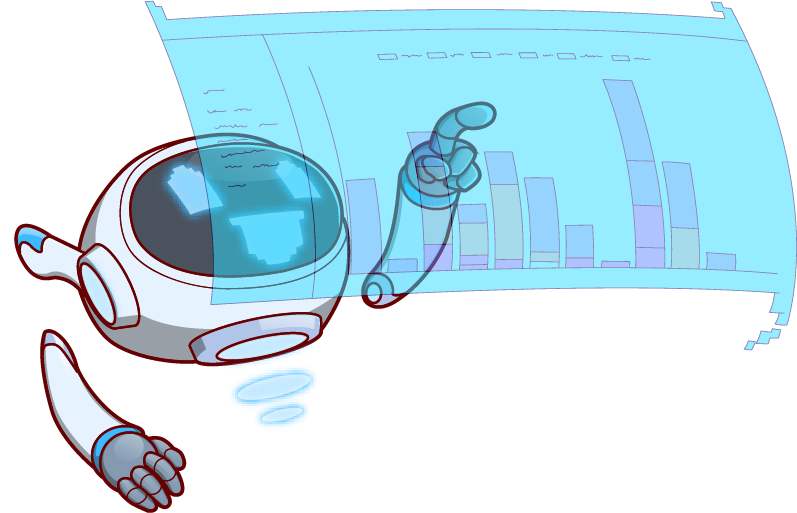

# Iq Option Bots

<!---Esses são exemplos. Veja https://shields.io para outras pessoas ou para personalizar este conjunto de escudos. Você pode querer incluir dependências, status do projeto e informações de licença aqui--->



> Bots for automating Binary Option Trading.

### Changelog and Roadmap

The project is still under development and next releases will focus on the following:

- [x] Version 2.0: Now we are a web app!
    - Refactored code for better extendability
    - Created user interface
   
- [] Add more strategies.


## 💻 Getting started

* Make sure you have `<python 3.9>`
* You have an account on the desired Exchange.

## 🚀 Installing

Windows:
```
$ pip install -r requirements.txt
```

## ☕ Running the project

```
$ streamlit run app.py
```
## 😄 Want to help keeping the project?<br>

You want to contribute to the project? 
Make a donation on.

<a href="https://www.paypal.com/cgi-bin/webscr?cmd=_s-xclick&hosted_button_id=GSZBCGK7Z465J&source=url">
    
